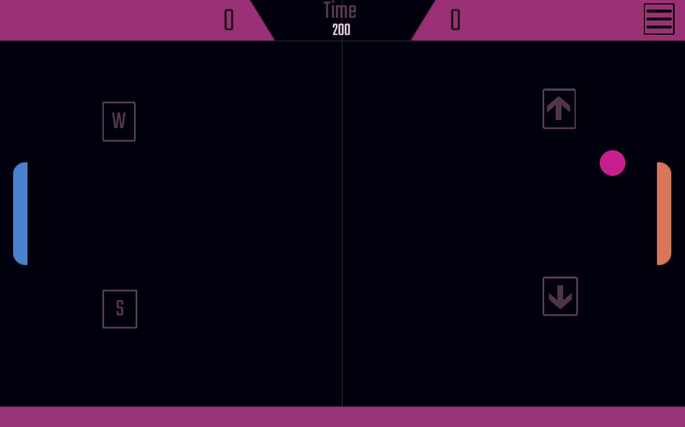

# Pong

## Descripción

Este proyecto es una implementación del clásico juego Pong utilizando Unity. Pong es uno de los primeros videojuegos de arcade y es un excelente ejemplo para comprender los conceptos básicos de desarrollo de juegos. En este juego, dos jugadores controlan paletas para golpear una pelota y marcar puntos. El objetivo es conseguir más puntos que el oponente.

## Características

- **Multijugador local**: Dos jugadores pueden competir de forma local controlando cada uno una paleta.
- **IA para un jugador**: Juega contra una IA con diferentes niveles de dificultad.
- **Sonidos de rebote**: Efectos de sonido cada vez que la pelota rebota en una paleta o en las paredes.
- **Pausa y reanudación**: El juego se puede pausar y reanudar fácilmente.
- **Interfaz intuitiva**: Controles simples y fáciles de usar.

## Controles

- **Jugador 1**: Usa las teclas `W` y `S` para mover la paleta hacia arriba y hacia abajo.
- **Jugador 2**: Usa las teclas de flecha `Arriba` y `Abajo` para mover la paleta hacia arriba y hacia abajo.

## Instalación

1. Clona o descarga este repositorio en tu computadora.
2. Abre el proyecto como una Pagina Web.
3. Ejecuta el juego.

## Enlace al juego

Puedes jugar a la versión en línea del juego aquí: Pong Game

--- 

¡Espero que disfrutes jugando a esta versión de Pong! Si tienes alguna pregunta o sugerencia, no dudes en contactarme.